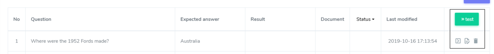

# Bulk tests

### Create a test

Click the 'Create test' button to create a test.

Type a name of the test and describe it at the 'Create a test' modal and click the 'Save' button.

Click the test name to get in the detail page for the bulk test.

### Bulk test management

* **Edit button:** Click the Edit button, a sub-button of the ... button to change the name, description and threshold of the test. You can see the created and modified date.
* **Make a copy button:** You can make a duplication of the test.
* **Delete button:** You can delete the test.

### Test page

* **Test information:** You can see the name, the description and the file name uploaded to the test. To modify the name, description and threshold, click the '...' button and the 'Edit' button.
* **Result statistics:** You can see the total number of test cases in the test, the number of success cases and failure cases.
* **Result detail:** You can see the detailed results of the test cases. 

### **Test cases upload by 'Add a file' button**

The test file must be uploaded to proceed with the test.

Download a test case template, and type questions in the first column and expected answers in the second column of the xlsx sheet.

If you have a prepared file for bulk testing, drag and drop the file in the box and click the 'File upload' button in the modal.

### **Test case upload by '+ Add' button**

You can add a single test case with clicking the '+Add' button.

### Run the bulk test

Click the green '&gt;&gt; test' button to run bulk testing. To run a singular test, click 'run' icon button on the row.

