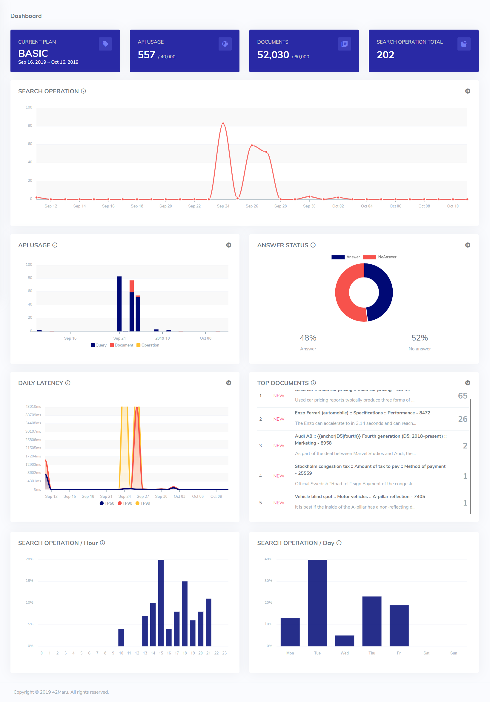

# Dashboard

* **API usage by plan :** Shows the API usage by your plan.
* **Document cumulative amount by plan :** Shows the cumulative amount of the documents by your plan.
* **Search operation count :** Shows the number of search operations calls per day for the last 30 days. ****
* **API usages :** Shows the number of API calls per day in the last 30 days.
* **Answer status :** Shows the search result status ratio in the last 30 days.
* **Search latency :** Shows the latency of the 50th, 90th, and 99th percentiles for search operations in the last 30 days.
* **Top viewed document :** Shows the rankings of the most frequently viewed documents.
* **Search operation by time and day :** Shows the search operation percentage by time and day.

