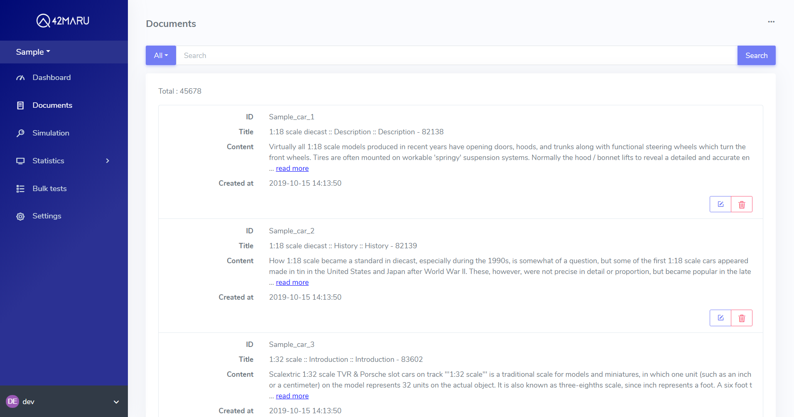
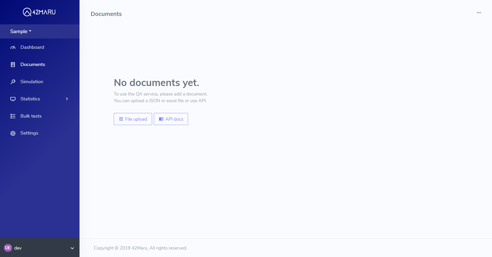
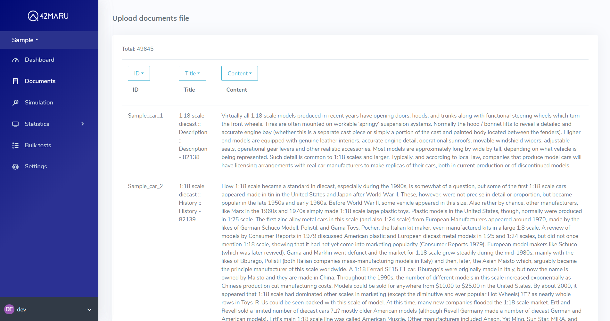
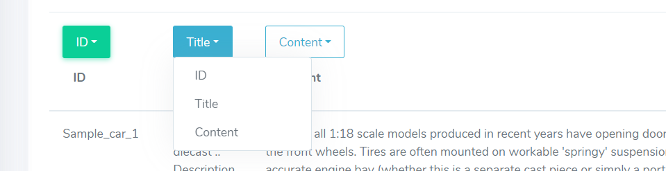
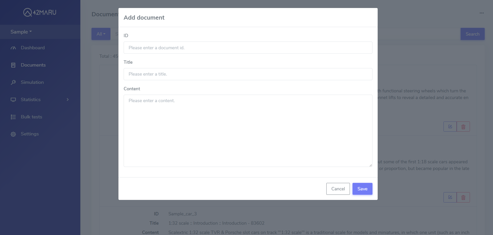

# Documents



*  **ID:** A unique code assigned to each document. If you do not specify a code, the system will automatically assign a code.
*  **Title** \(Required\): ****A title of a document.
*  **Content** \(Required\): Core target data for searching. Searching with MRC is more suitable for longer paragraphs than shorter ones.
* **Created at:** Shows the time the documents uploaded on the server.

### Insert documents by 'File upload' button

Click the \[File upload\] button, and a new drag and drop window for upload will pop up. The same can be done by clicking the 'File upload' button in the '…' icon button at the top right of the page.




Supported file formats: json, xlsx



Drop a file or click the box to upload. For xlsx files, it is recommended that the files contain fields for ID, Title and Content. Click the 'Preview' button to preview the data.


* Title and Content are mandatory, and ID is optional.
* Only the first sheet of the xlsx file can be called up.
* Blanked columns are not imported.






To configure ID, Title and Contents fields of documents, click the drop-down box at the top of the first row of the table. Then, click the 'Save' button at the bottom of the page to upload the file to the server.

### **Insert a single document by 'Add document' button**






Insert documents by API



Insert a document






Application id



Key with access to application










```yaml
{
    "data": {
        "id": 3044702,
        "doc_id": 337842,
        "application_id": 24,
        "title": "limiting enzyme",
        "content": "By reacting with the target DNA using several types of restriction enzymes, each of which recognizes a particular sequence of bases and cuts the DNA, indicating where the specific restriction enzyme action is relatively located. Using this, we draw up a genetic map..",
        "deleted": false,
        "created_at": "2019-08-07T02:27:54",
        "updated_at": null
    }
}
```




Content is an essential information.


```yaml
{
    "error_message": "Required is content"
}
```





Body parameters


content is an essential information.


```yaml
{
    "doc_id": 337842,
    "title": "limiting enzyme",
    "content": "By reacting with the target DNA using several types of restriction enzymes, each of which recognizes a particular sequence of bases and cuts the DNA, indicating where the specific restriction enzyme action is relatively located. Using this, we draw up a genetic map."
}
```



Insert multiple documents



Insert multiple documents






Application id



Key with access to application










```yaml
{
    "data": {
        "message": "success"
    }
}
```




Content is an essential information.


```yaml
{
    "error_message": "Required is content"
}
```




Inserted file is too big


```yaml
{
    "error_message": "Too big content_length must be shorter than 10000000"
}
```





Body Parameters


content is an essential information.


```yaml
[
    {
        "doc_id": 337842,
        "title": "limiting enzyme",
        "content": "By reacting with the target DNA using several types of restriction enzymes, each of which recognizes a particular sequence of bases and cuts the DNA, indicating where the specific restriction enzyme action is relatively located. Using this, we draw up a genetic map."
    },
    {
        "doc_id": 337842,
        "title": "limiting enzyme",
        "content": "The part of a person's DNA that produces useful substances is cut with a restriction enzyme and then connected the piece to the plasmid DNA of E. coli. Insert modified plasmid into E. coli, producing a large quantity of useful material in a short time."
    },
    {
        "doc_id": 1758246,
        "title": "Actor B",
        "content": "Yale University \r\n"
    },
    {
        "doc_id": 1758246,
        "title": "Actor B",
        "content": "--《 Movie-1 》 (Year 2017) – Casting of A\r\n--《 Movie-2》 (Year 2016) – Casting of B\r\n--《 Movie-3 》 (Year 2016) - Casting of C \r\n"
    }
]
```

## Documents management


